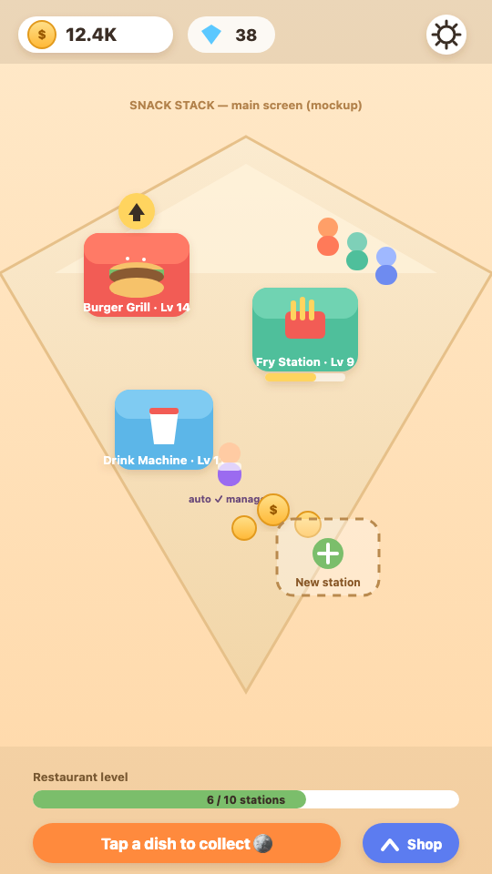
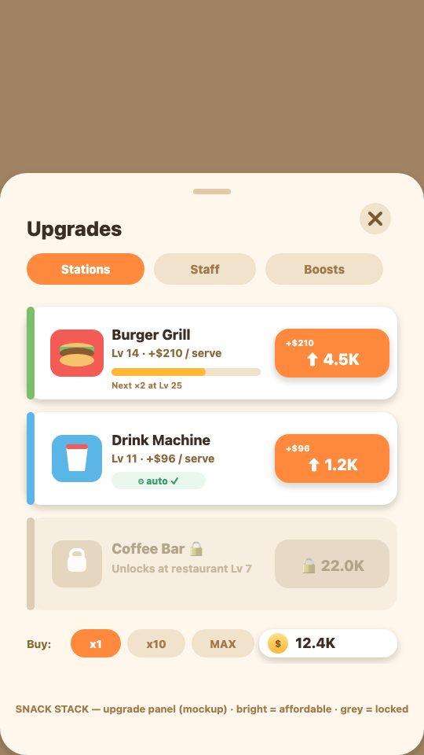

# PRD — "Snack Stack" (idle restaurant-tycoon game)

| | |
|---|---|
| **Working title** | Snack Stack (placeholder — final name TBD) |
| **Status** | Draft — design only (no game code yet) |
| **Version** | 0.1.0 |
| **Owner** | (assign) |
| **Last updated** | 2026-06-06 |
| **Target runtime** | The playground **Phaser 3 sandbox** (`src/pages/learn/playground/`) |
| **Genre** | Idle / incremental restaurant tycoon |

> **IP & naming note.** This design is an **original** game in the idle
> restaurant-tycoon **genre**. It studies how games like *Eatventure* (©
> Lessmore) *work* and adopts the genre's **mechanics and visual conventions**,
> but ships **our own** art, characters, names, copy, level content, and
> branding. Do **not** import that game's assets, trademarked name, or specific
> level/recipe lists into the product. All mockups in this folder are original
> interpretations of genre conventions, not reproductions.

---

## 1. Summary

A cheerful, tap-light **idle tycoon**: the player runs a little fast-food spot
where cooking **stations auto-produce** food, **money piles up**, and the player
**taps to collect** and **reinvests** into upgrades. Early play is hands-on
(manual taps, tight budgeting); as the player buys upgrades and **hires managers
to automate stations**, the spot increasingly runs itself — the satisfying
"watch it grow" loop of the genre.

It's a showcase of what the platform's Phaser sandbox can do, and a friendly,
**kid-appropriate** game: **no real-money purchases, no ads, no PII.**

## 2. Goals / Non-goals

**Goals (in scope for v1)**
- The **core idle loop**: auto-cooking stations → money piles → tap-to-collect →
  buy/place new stations.
- **Station upgrades** (raise speed and/or value) with an escalating cost curve.
- **Manager automation**: a one-time hire makes a station auto-collect, so the
  player no longer needs to tap it.
- A single restaurant that visibly fills out as the player grows it.
- Runs cleanly inside the **Phaser sandbox** constraints (see §8).

**Non-goals (explicitly deferred)**
- **Offline / idle-while-away earnings** and a "welcome back" reward.
- **Expansion / prestige** — new restaurants/locations, reset-for-boost.
- **Persistence / save** (in-memory only for v1; see §9 + Open Questions).
- **Premium currency (gems)** as a core system — at most a light, *earned-only*
  meta later; not required for v1.
- Any **monetization** (no IAP, no rewarded ads).

## 3. Player & context

- **Audience:** kids on the Learn surface; also a demo of the game studio.
- **Session:** dip-in/dip-out; a satisfying first 2–3 minutes, then idle.
- **Orientation:** **portrait**, mobile-first; scales to fit the runner pane.
- **Tone:** friendly, low-stakes, colorful. No fail states that punish.

## 4. Core gameplay loop

```
        ┌─────────────────────────────────────────────┐
        │  Stations auto-cook on a timer                │
        │           ↓                                   │
        │  A finished dish becomes a collectible coin   │
        │           ↓                                   │
   tap →│  Player TAPS to collect → money goes up       │  (or a hired
        │           ↓                                   │   MANAGER auto-collects)
        │  Player SPENDS money: upgrade a station       │
        │  (faster / worth more) or buy a NEW station   │
        │           ↓                                   │
        │  Income rises → next upgrade affordable sooner│
        └───────────────────────────┬─────────────────┘
                                     └──→ repeat (snowball)
```

The player is an **investor/manager**, not a cook: they route a growing coin
stream into the **highest-leverage** next purchase. The fun is spotting the
current **bottleneck** (a slow station, an un-automated station) and clearing it
so the snowball resumes.

## 5. Entities & systems

- **Station** — a cooking appliance (e.g. Fry Station, Burger Grill, Drink
  Machine) that produces one product on a fixed **cycle**. Tappable. Has a
  **level**, an **upgrade cost**, a **production time**, a **value per serve**,
  and an **automated** flag.
- **Product** — the food a station makes; higher-tier stations make
  higher-value products. (Visual only — no inventory to manage in v1.)
- **Money (cash)** — the single core currency. Earned by collecting finished
  dishes; spent on upgrades, new stations, and manager hires.
- **Customers / queue** — small sprites that line up at the counter. In v1 they
  are **ambient juice** (they make the place feel alive); serving is automatic
  and there is **no "angry customer" fail state**.
- **Manager (automation)** — a one-time **hire** per station. Once hired, that
  station **auto-collects** its finished dishes (no taps needed). This is the
  genre's "pay once to run itself forever" pattern.
- **New-station plots** — empty **dotted-outline** footprints the player taps to
  buy and place the next station.

## 6. Economy & balancing

The engine of the genre: **costs grow geometrically while income grows roughly
linearly**, so the next upgrade is *always almost affordable*, and milestone
**multipliers** periodically reset that feeling with a satisfying jump.

**Formulas (starting point — tune in playtest):**
- `upgradeCost(level) = baseCost × costGrowth^(level − 1)` with `costGrowth ≈ 1.12–1.15`.
- `valuePerServe(level) = baseValue × level × milestoneMultiplier(level)`.
- `milestoneMultiplier` **doubles** at milestone levels (e.g. L25, L50, L100…),
  giving income a step-up that re-opens affordability.
- `incomePerSecond(station) ≈ valuePerServe / (productionTime in seconds)` once
  automated (or whenever the player taps promptly).

**Illustrative single-station curve** (original numbers, adapt freely):

| Level | Upgrade cost | Value / serve | Note |
|---|---|---|---|
| 1 | — | 4 | starting station |
| 5 | ~16 | 20 | |
| 10 | ~28 | 44 | |
| 25 | ~150 | 100 → **×2 = 200** | milestone doubling |
| 50 | ~2.6K | 240 → **×2 = 480** | milestone doubling |
| 100 | ~800K | 1,000 | a soft "wall" |

**Big numbers are a feature.** Values climb into **K / M / B**; players read
growth on an exponential scale, so compact notation (`1.2K`, `3.4M`) is the
norm, not a bug.

**Bottlenecks that drive the next purchase:**
- A station's dishes pile up faster than the player taps → **hire a manager**.
- A station is cheap to upgrade but low value → **upgrade value**.
- Income feels stuck → **buy the next, higher-tier station**.

## 7. Upgrades & automation (the two in-scope growth systems)

- **Upgrade station** — spend cash to raise a station's **value per serve**
  (and, at milestones, get a multiplier). Production speed improvements can be
  folded into the same upgrade track for v1 (one button per station) to keep the
  UI simple; a separate speed track is a future option.
- **Hire manager** — a one-time cash cost that sets `automated = true` for that
  station; from then on it **auto-collects**. This is the key "idle" unlock and
  the moment the game starts to feel like a tycoon.

The **upgrade UI** is a slide-up panel listing each station as a card: current
level, value, and a chunky **Upgrade** button showing the cost (bright when
affordable, greyed when not). Locked/next stations appear with a padlock.

## 8. Visual design (genre-style, original assets)

See the mockups in this folder (PNG previews; SVG is the editable source):

**Main game screen** — [SVG source](./mockup-game.svg)



**Upgrade panel** — [SVG source](./mockup-upgrades.svg)



**Art direction (our own assets, genre conventions):**
- **Flat cartoon, semi-3D** look; chunky simplified shapes, little/no outline,
  soft low-contrast shading. Friendly "soft-plastic toy" feel.
- **Camera:** gentle **2.5D / light isometric** floor — you look down at an angle
  and see the counters' fronts. (Achievable in Phaser with simple skewed/stacked
  shapes; true iso math is optional.)
- **Palette:** warm, bright, saturated — cream floors, red/orange "fast-food"
  energy, teal/yellow accents; **gold coins** with a white highlight.
- **Juice:** coins **fly** to the money counter then the counter **scale-pops**;
  `+$N` number popups drift up and fade; tapped objects do a quick
  **squash-and-stretch**; affordable upgrades **pulse/glow**.

**Layout (portrait):**
- **Top HUD** (thin, semi-transparent): money counter (coin + `1.2K`), a
  settings gear, and room for a future gem counter.
- **Play area** (hero): the isometric floor with stations, a counter holding
  collectible coins, an ambient customer queue, and a **dotted "new station"**
  plot. Floating **upgrade arrows** sit on stations that can be upgraded.
- **Bottom bar:** a global **progress bar** (toward "restaurant complete") and a
  corner **Upgrades** button that opens the panel. (No "watch ad" button — we
  don't run ads.)

## 9. Technical design (Phaser sandbox)

Targets the runtime contract in
[`../../CLAUDE.md`](../../CLAUDE.md) + `buildGamePreview.ts`: **Phaser 3 is a
global**, **no `import`/`export`** (every class/const is global; the entry
`main.js` is injected **last**), mount into `#game`, **assets inlined** (or, per
below, generated at runtime), portrait via `Phaser.Scale.FIT + CENTER_BOTH`.

**Scenes (global classes, wired in `main.js` last):**
- **`Boot`** — procedurally **generate textures** with `make.graphics().generateTexture(...)`
  so the game ships **zero binary assets** (sidesteps the V0 data-URL asset
  rewrite). Then `scene.start('Game')`.
- **`Game`** — owns the economy: `money`, the station list, the tick timer,
  input, and tweens. Stations are `Container`s (icon + level badge + progress
  bar + tap zone).
- **`Hud`** — launched in **parallel** (`scene.launch('Hud')`, `bringToTop`) so
  the HUD doesn't scroll/scale with the world. Updated via the scene event bus
  (`this.scene.get('Game').events.emit('money', n)`).

**Virtual resolution:** fixed **540×960** (9:16); author all coordinates against
it and let `Scale.FIT` letterbox to any device. No responsive math in game code.

**Data model (data-driven; one global config array):**
```js
// loaded BEFORE main.js
const STATION_DEFS = [
  { id: 'fries', name: 'Fry Station',
    level: 1, baseCost: 10, costGrowth: 1.15,
    productionTime: 2000, baseValue: 4,
    automated: false, managerCost: 250,
    _elapsed: 0, _ready: false },   // _-prefixed = runtime-only
  // burger, drink, … with growing baseCost / productionTime / baseValue
];
function upgradeCost(s) { return Math.ceil(s.baseCost * Math.pow(s.costGrowth, s.level - 1)); }
function valuePerServe(s) { return Math.floor(s.baseValue * s.level /* × milestoneMult */); }
```
- **Upgrade:** `money -= upgradeCost(s); s.level += 1;`
- **Hire:** `money -= s.managerCost; s.automated = true;`

**Tick loop (one scene timer, not per-station):**
```js
this.time.addEvent({ delay: 100, loop: true, callback: this.tick, callbackScope: this });
// tick(): add 100ms to each s._elapsed; when >= productionTime, reset and either
//   manual    → s._ready = true (bob the station to invite a tap)
//   automated → collect(s) immediately (the manager auto-collects)
```
`collect(s)`: `money += valuePerServe(s)`, clear `_ready`, fire the coin-fly +
counter-pop juice.

**Number formatting** (built-in, no library):
```js
const fmt = new Intl.NumberFormat('en', { notation: 'compact', maximumFractionDigits: 1 });
// 1200 → "1.2K", 3.4e6 → "3.4M"
```

**Sandbox notes / gotchas:**
- The runner's **pause/resume** calls `game.loop.sleep()/wake()`, which also
  halts `this.time` events — the idle loop pauses for free.
- Keep `main.js` the **only** file that constructs `new Phaser.Game(...)`; all
  scene classes + `STATION_DEFS` + helpers live in files injected **before** it.
- **No `localStorage`** assumption — state is in-memory; a restart resets
  progress (acceptable for v1; persistence is an Open Question).

## 10. Kid-appropriateness & accessibility

- **No** real-money purchases, **no** ads, **no** external links, **no** PII.
- No punishing fail states; customers never "rage-quit."
- Large tap targets; readable big numbers; colorblind-friendly cues (shape +
  glow, not color alone, for "affordable").

## 11. Success criteria (v1 acceptance)

- A new player can, within ~30s, see a station cook, **tap to collect**, and
  **buy an upgrade**.
- After hiring the first **manager**, that station visibly **auto-collects**.
- Money displays in compact notation and the **coin-fly + pop** juice fires on
  collect.
- The whole thing runs inside the Phaser sandbox with **no binary assets** and
  no console errors; pause/resume from the runner halts/resumes the idle loop.

## 12. Open questions / future work

1. **Persistence/save.** v1 is in-memory. A save could ride the same seam as the
   editor's `projectPersistence` (local IndexedDB) and later a backend write.
2. **Offline earnings** + welcome-back reward (deferred non-goal).
3. **Expansion / prestige** — new restaurants and a reset-for-boost loop.
4. **Separate speed vs. value** upgrade tracks (v1 folds them into one).
5. **Earned-only gems** as a light permanent-boost meta.
6. **Final name & brand**, original character/mascot design.

## 13. Decision log

- **D1 — Original genre clone, our assets.** Replicate mechanics + visual
  conventions; never ship the studied game's name/art/levels. (IP-safe; required
  for the kids platform.)
- **D2 — Scope = core loop + upgrades + automation only.** Offline, prestige,
  and persistence deferred to keep v1 shippable.
- **D3 — Zero binary assets via `generateTexture`.** Avoids the sandbox's V0
  data-URL asset path; keeps the whole game self-contained.
- **D4 — Cash-only economy for v1.** Gems/premium currency out of core scope.

## 14. Revision history

- **0.1.0 (2026-06-06)** — Initial draft from multi-agent genre research
  (mechanics, visual conventions, economy math, Phaser-sandbox architecture).
  Design only; no game code yet.
</content>
